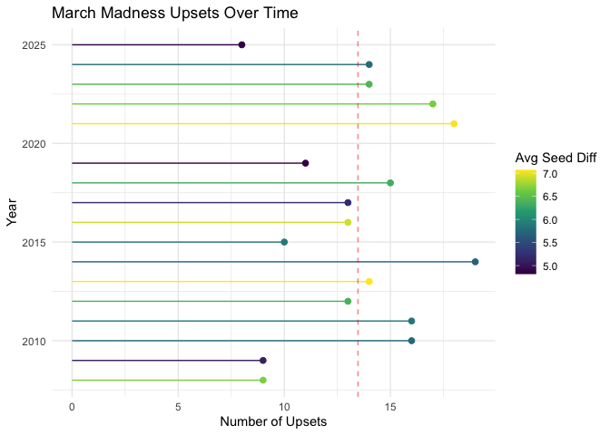
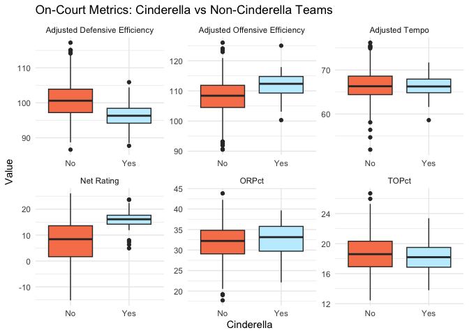

# March Madness Upsets

### Data Introduction

The NCAA Men’s Basketball Tournament, commonly known as March Madness,
is one of the most unpredictable sporting events in the United States.
It features 68 teams competing in a single elimination format, this
structure creates an environment where unexpected outcomes can occur.
Which is why this analysis focuses on upsets and Cinderella teams, which
are double-digit seeded teams that win multiple games in the tournament

The data used in this analysis comes from two datasets sourced from
Kaggle. One dataset contains information on game outcomes, including the
number of upsets in each tournament and the seed matchups involved. The
second dataset includes team-level statistics, such as offensive and
defensive efficiency metrics. Together, these datasets allow for an
analysis of how team characteristics relate to unexpected success in
March Madness.

### Questions of Interest

#### Main Research Question:

- What team characteristics are associated with unexpected success in
  March Madness?

To answer this, the analysis focuses on:

- How common upsets are across different tournaments
- Which on-court performance metrics are associated with Cinderella
  teams
- Which off-court factors are associated with Cinderella teams
- Whether all Cinderella teams follow similar patterns, using case
  studies such as Davidson, Loyola Chicago, and Saint Peter’s

### Plot 1: March Madness Upsets Over Time

### Plot 2: On-Court Metrics: Cinderella vs Non-Cinderella Teams

### Key Takeaways

The results show that while upsets vary from year to year with no clear
trend, certain on-court metrics, especially offensive efficiency and net
rating are more strongly associated with teams that achieve unexpected
success. In contrast, the off-court factors that were looked at show
weaker relationships. The case studies that were reviewed show how there
are common patterns among Cinderella teams, but there is still
variability across different tournament runs.

Overall, the findings suggest that offensively oriented teams are more
likely to succeed in a single elimination setting, while still
reinforcing the unpredictability that defines March Madness.
